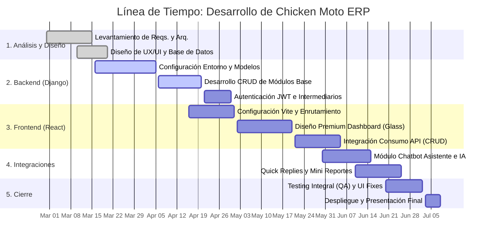

# Resumen Ejecutivo de Desarrollo: Chicken Moto ERP

Este documento contiene la recopilación y justificación de todos los desarrollos realizados en el sistema informático, listo para ser copiado e integrado en tu documento de Word final.

## 1. Detalles Técnicos y Desarrollo Realizado

El sistema "Chicken Moto ERP" fue modernizado y construido bajo una arquitectura robusta, dividiéndose en las siguientes áreas de intervención:

### 1.1 Arquitectura y Base de Datos
*   **Migración de Entorno:** Se configuró el proyecto para funcionar sobre una base sólida y moderna orientada a entornos locales comerciales usando XAMPP y MySQL como motor de base de datos relacional.
*   **Gestión de Archivos:** Implementación de la librería *Pillow* para el procesamiento y almacenamiento seguro de las imágenes de productos desde los modelos de base de datos.

### 1.2 Desarrollo Backend (Django & API REST)
*   **Construcción de la Interfaz de Programación (API/CRUD):** Creación de endpoints completos utilizando **Django REST Framework**. Se abarcaron todos los submódulos Core:
    *   **Inventario:** Gestión completa de productos y control de stock.
    *   **Clientes:** Agenda, seguimiento de información de clientes y gestión de entidades.
    *   **Taller:** Creación y seguimiento de órdenes de trabajo y control del estado de reparaciones (motos, reportes técnicos).
*   **Capas de Seguridad (Auth):** Instalación y configuración de autenticación segura vía tokens con *JSON Web Tokens (JWT)* (`djangorestframework-simplejwt`), permitiendo sesiones de usuario protegidas, robustas y de estado inmutable (Stateless).

### 1.3 Desarrollo Frontend - Interfaces Premium (React & Vite)
*   **Experiencia de Usuario:** En lugar de interfaces básicas, se construyó un Dashboard integral con filosofía de *Premium Design*.
*   **Tecnologías UI:** Componentización orientada a objetos usando **React** con el motor ultrarrápido **Vite**.
*   **Optimizaciones Visuales:** 
    *   Corrección y refinamiento profundo de problemas de visualización, como el "Stacking Context" (solapamiento incorrecto de divs/z-index).
    *   Implementación de estética moderna basada en *Glassmorphism* (Efectos de cristalizado), interfaces dinámicas y animaciones sutiles interactivas.

### 1.4 Innovación: Chatbot Asistente Interno 2.0 (Copilot)
*   Se integró dentro del Dashboard un agente conversacional nativo y responsivo.
*   **Comandos NLP y Consultas Agrupadas:** El chatbot interactúa con las bases de datos para responder de inmediato consultas métricas (Ej: Stock crítico, Ventas totales, Órdenes en progreso).
*   **Mini-Reportes Enriquecidos:** Retorno de reportes condensados con formatos en negrita resaltando el balance y estatus.
*   **Burbujas Inteligentes (Quick Replies):** Botones predictivos implementados en el widget del chat para enviar comandos complejos en un solo clic, permitiendo operar sin necesidad de usar el teclado para el 80% de las consultas comunes.

---

## 2. Línea de Tiempo de Desarrollo (Febrero 28 - Julio 8)

A continuación se muestra el diagrama Gantt/Línea temporal utilizando especificaciones de Mermaid. (Copia este código y ponlo en cualquier visualizador de Mermaid para generar el gráfico que va al Word).

